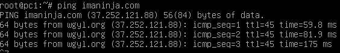
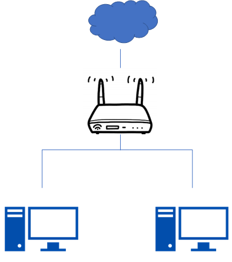

Zadanie 1
---------

1. Zaprojektuj oraz przygotuj prototyp rozwiązania z wykorzystaniem oprogramowania ``VirtualBox`` lub podobnego. 
Zaproponuj rozwiązanie spełniające poniższe wymagania:
   * Usługodawca zapewnia domunikację z siecią internet poprzez interfejs ``eth0`` ``PC0``
   * Zapewnij komunikację z siecią internet na poziomie ``LAN1`` oraz ``LAN2``
   * Dokonaj takiego podziału sieci o adresie ``172.22.128.0/17`` aby w ``LAN1`` można było zaadresować ``500`` adresów natomiast w LAN2 ``5000`` adresów    
   * Przygotuj dokumentację powyższej architektury w formie graficznej w programie ``DIA``
 
* Tworzymy 3 maszyny wirtualne: PC0 - jako router i PC1,PC2 jako urządzenia 
* Dzielimy sieci: LAN1 otrzymała adres `172.22.160.0/23` żeby pomieściła 500 adresów 
                     LAN2 otrzymała adres `172.22.128.0/19` żeby pomieściła 5000 adresów 
* ustalamy adresy PC1 i PC2: 
  `ip a add 172.22.160.6/23 dev enp0s3` 
  `ip a add 172.22.128.6/19 dev enp0s3` 
* ustalamy adresy w PC0: 
 ` ip a add 172.22.160.1/23 dev enp0s8` 
 ` ip a add 172.22.128.1/19 dev enp0s9` 
* podnosimy interfejsy: 
 ` ip link set enp0s8 up` 
 ` ip link set enp0s9 up` 
* Podczas wykonywania zadania pomyliłem się i musiałem pozbyć się błędnie wpisanych adresów: 
 ` ip flush` 
* Używając powyższej komendy usuną się również adres sieci NAT, przywróciłem ją wpisując następujące polecenia: 
  `dhclient -r` 
  `dhclient` 
 * W pliku `sysctl.conf` trzeba było odkomentować 1 linijkę dotyczącą ipv4 
 * Z PC0 pingowało już do PC1 i PC2 ale odwrotnie już nie 
 * problemem był nameserver w pliku `/etc/resolv.conf` po zmianie działało. 
 * Żeby pingowało z PC1 i PC2 do google trzeba było dodać: 
  `ip route add default via 172.22.160.1` (PC1)  
  `ip route add default via 172.22.128.1` (PC2) 
  `echo 1 > /proc/sys/net/ipv4/ip_forward`(PC0) 
  `iptables -t nat -A POSTROUTING -s 172.22.160.0/23 -o enp0s3 -j MASQUERADE`(PC0) 
  `iptables -t nat -A POSTROUTING -s 172.22.128.0/19 -o enp0s3 -j MASQUERADE`(PC0) 
  
  Diagram
  ---------
  
